# Integração Vault com Keycloak

## Configurando os serviços

- Configurando os hosts

```console
$ ansible-playbook -i inventories/virtualbox.yml site.yml --tags setup
```

- Postgres

```console
$ ansible-playbook -i inventories/virtualbox.yml site.yml --tags pgsql
```

- Keycloak

```console
$ ansible-playbook -i inventories/virtualbox.yml site.yml --tags keycloak
```

- Vault

```console
$ ansible-playbook -i inventories/virtualbox.yml site.yml --tags vault
```

# Configuração para integração

## Acessando o Keycloak

> Credenciais

- URL:  http://192.168.10.3:8089/
- User: `admin`
- Password: `admin`

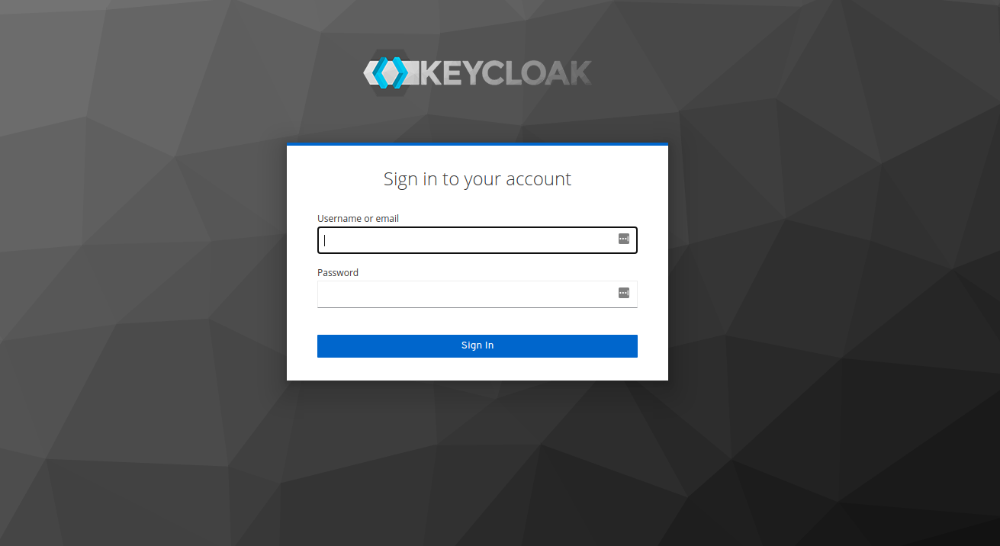

> Adicionando um novo `realm`

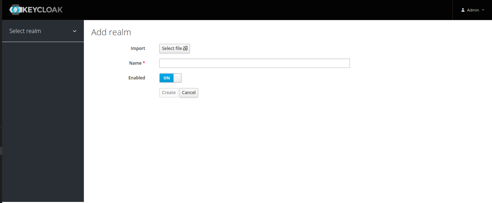

> Criando um novo cliente - `create`

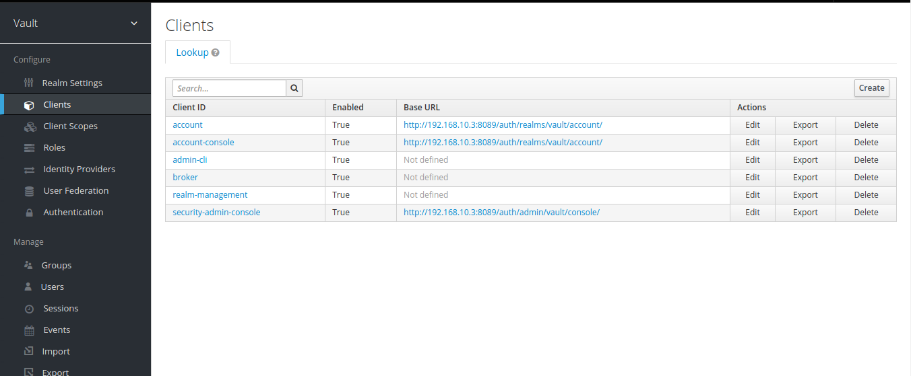

> Configurando o novo cliente - `settings`

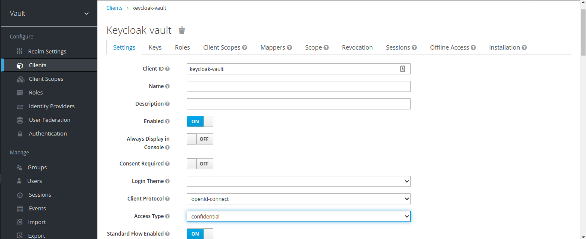

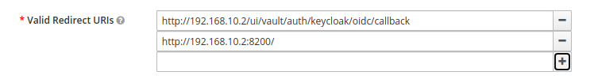

> Copiando a credencial do client para ser configurada no vault mais na frent

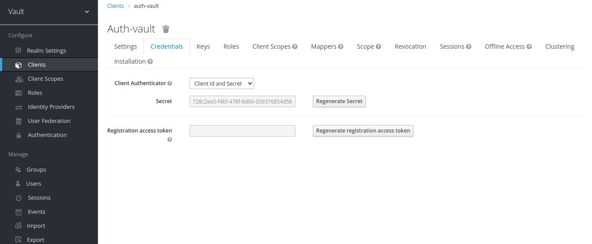

>  Criando um usuário - `àdd user`

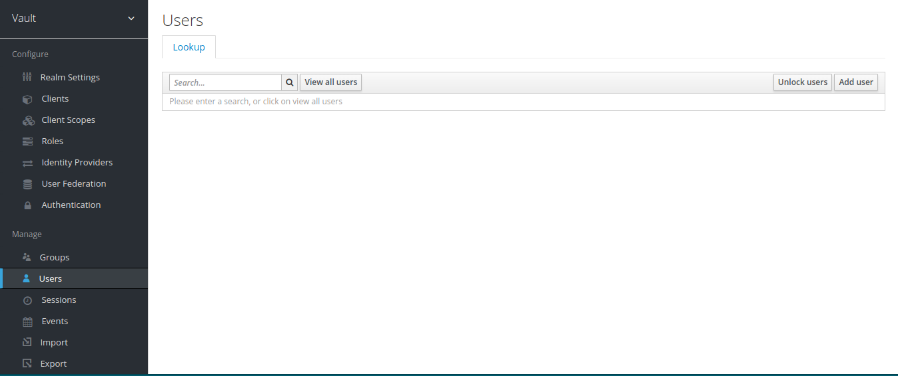

## Acessando o Vault 

> URL: http://192.168.10.2/ui

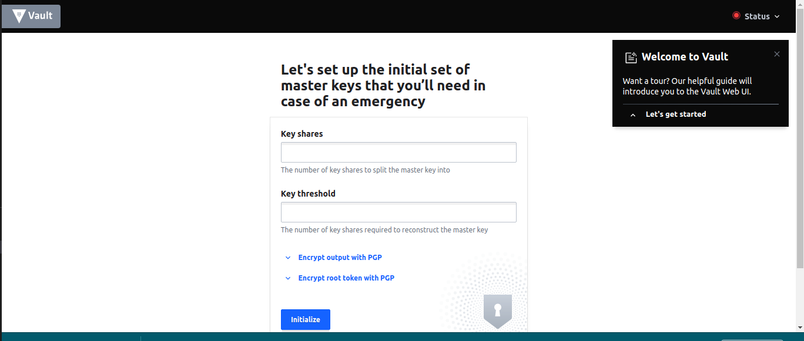

> Inicializando o Vault

- Acessando o Container

```bash
$ docker exec -it vault bash
```

- Iniciando o Vault
```bash
$ vault operator init
```

- Saída

```bash
Unseal Key 1: PX35l4eJHf5aG8Q43qiqdjBvXm4YkIBnxOw2rXh+B8s3
Unseal Key 2: p7RCYo6IG1Us+IfEbWke2vZmRtMpOJke98Eb1iB3VoDw
Unseal Key 3: seYE0hPvNqnZ7hIR4PnEk2RFpZbko8h3snnIkIKVRoGz
Unseal Key 4: yy3JxKqeRZRSTkcZ0LFQIfPSFadStTOlb07rmSTg2D4L
Unseal Key 5: 3O7XBRBxDe5jcWo1SdertTkIgYdrfrVxpOrS2KwgIaTR

'Initial Root Token:' s.dCppxz9A4ev6kDdZz8F7m656

Vault initialized with 5 key shares and a key threshold of 3. Please securely
distribute the key shares printed above. When the Vault is re-sealed,
restarted, or stopped, you must supply at least 3 of these keys to unseal it
before it can start servicing requests.

Vault does not store the generated master key. Without at least 3 key to
reconstruct the master key, Vault will remain permanently sealed!

It is possible to generate new unseal keys, provided you have a quorum of
existing unseal keys shares. See "vault operator rekey" for more information.

```
> Desbolqueando o Vault - Utilize 3 das 5 chaves acima:

```bash
$ vault operator unseal PX35l4eJHf5aG8Q43qiqdjBvXm4YkIBnxOw2rXh+B8s3
$ vault operator unseal p7RCYo6IG1Us+IfEbWke2vZmRtMpOJke98Eb1iB3VoDw
$ vault operator unseal seYE0hPvNqnZ7hIR4PnEk2RFpZbko8h3snnIkIKVRoGz
```

- Chave `root` utilizada para logar no Vault: Tanto via cli quanto web:

```bash
vault login s.dCppxz9A4ev6kDdZz8F7m656
```

- Habilitar um dispositivo de auditoria que mantém um registro detalhado de todas as solicitações e respostas ao Vaul
```bash
$ vault audit enable file file_path=/vault/logs/audit.log
```

- Testando, execute o seguinte comando para visualizar todos os dispositivos de auditoria habilitados:
```bash
$ vault audit list
```

>> Acesso WEB

- url: `http://192.168.10.2/ui`
- Autenticação via Token: `s.dCppxz9A4ev6kDdZz8F7m656`

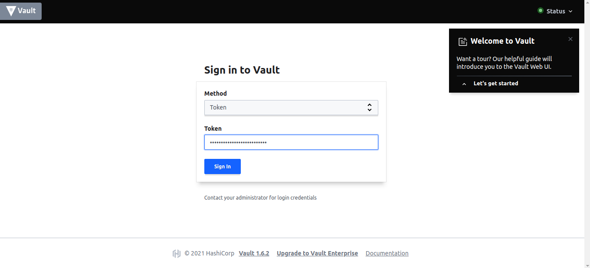

> Dashboard Vault

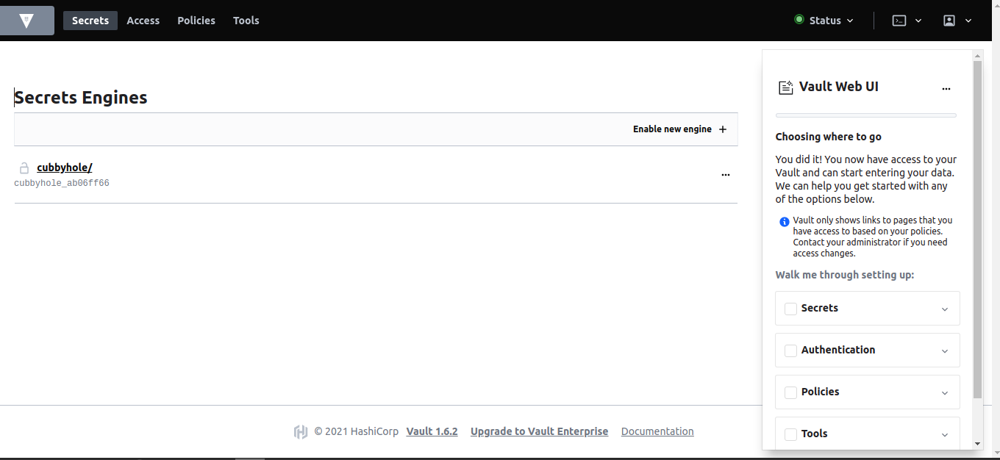


## Polices

> Acessando o Container

```bash
$ docker exec -it vault bash
```

> Criando as políticas

``` bash
$ vault policy write manager -<<EOF
path "/secret/*" {
    capabilities = ["create", "read", "update", "delete", "list"]
}
EOF
```

``` bash
$ vault policy write read -<<EOF
path "/secret/*" {
    capabilities = ["read", "list"]
}
EOF
```

> Verificar as polices

```bash
$ vault policy list
```

## Auth Methods

> Criando método de autenticação

```bash
vault auth enable \
        -path=keycloak \
        -listing-visibility="unauth" \
        oidc
```

```bash
vault write auth/keycloak/config \
        oidc_discovery_url="http://192.168.10.3:8089/auth/realms/vault" \
        oidc_client_id="auth-vault" \
        oidc_client_secret="728c2ee5-f4bf-478f-8d06-039376854d58" \
        default_role="manager" \
        type="oidc"
```

```bash
vault write auth/keycloak/role/manager \
        bound_audiences="auth-vault" \
        allowed_redirect_uris="http://192.168.10.2/ui/vault/auth/keycloak/oidc/callback,http://192.168.10.2:8200/,http://192.168.10.2:8250/oidc/callback" \
        user_claim="sub" \
        policies="manager" \
        ttl=1h \
        role_type="oidc" \
        oidc_scopes="openid"
```

## Login

> Agora a opção de logar via `keycloak` ja deve aparecer. Não precisa preencher nada, basta clicar em logar com provedor `OIDC`

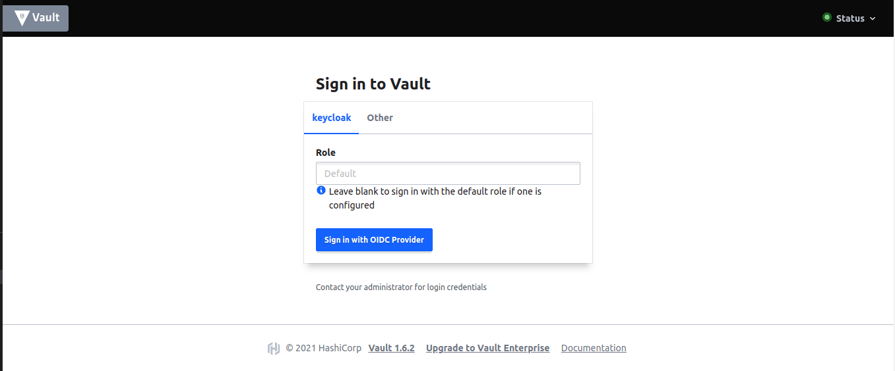

- Logar com o usuário que foi criado no keycloak

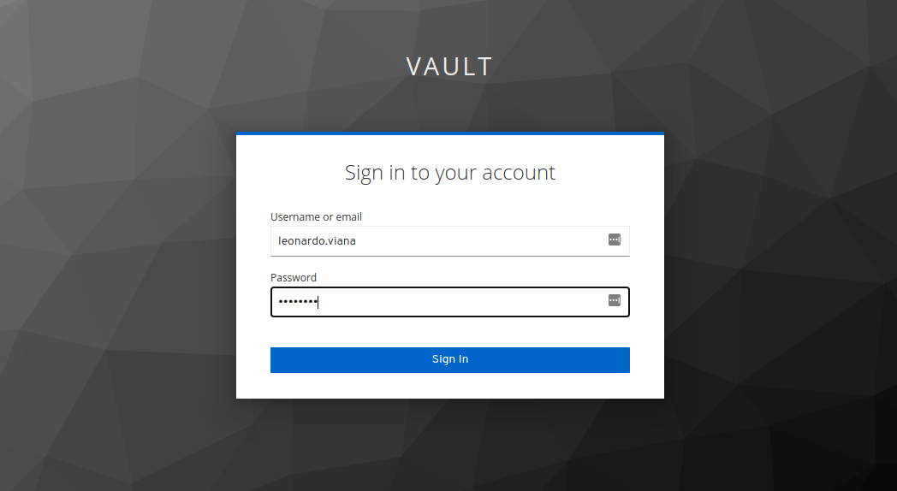

- Você deve ser encaminhado para o dsahboard principal

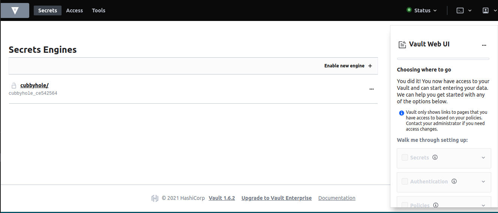

## Referência

- https://blog.ichasco.com/keycloak-autenticacion-oidc-bajo-traefik/
- https://blog.ichasco.com/vault-habilitar-la-autenticacion-mediante-keycloak/
- https://number1.co.za/using-keycloak-as-the-identifyprovider-to-login-to-hashicorp-vault/
- https://www.vaultproject.io/docs/auth/jwt/oidc_providers#http-localhost-8250-oidc-callback


